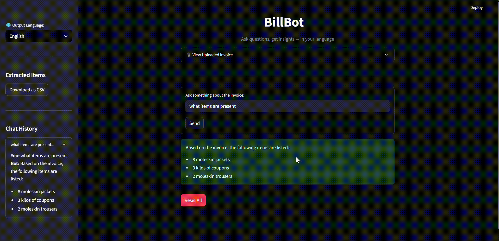
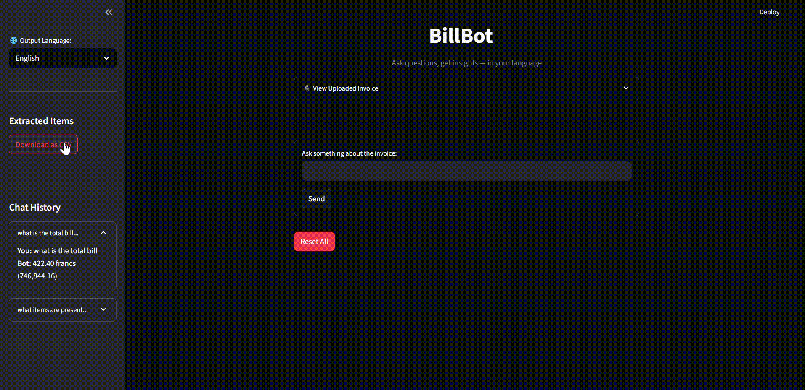

---

# BillBot – Multilanguage Invoice Chatbot

BillBot is a **Streamlit-based AI-powered invoice chatbot** built with **Google Gemini 2.5 Pro**.
It helps users **upload invoice images, extract tabular item details, and ask questions about invoices in multiple Indian languages**.

---

## ✨ Core Functionalities

* **Upload Invoice Images** – Supports `.jpg`, `.jpeg`, `.png`.
* **Item Extraction to CSV** – Automatically extracts item details like *Item Name, Price, Tax, Total* and allows CSV download.
* **Multi-language Support** – Supports 15+ Indian languages (Hindi, Odia, Bengali, Tamil, Telugu, Gujarati, Punjabi, Urdu, etc.).
* **Interactive Chatbot** – Ask invoice-related queries in natural language and get answers in your chosen language.
* **Chat History & Re-Translation** – Keeps chat history and allows instant re-translation when switching languages.
* **Smart Validation** – Detects if the image is not an invoice or if the image is unclear.

---

## Live Demo

### Ask questions


### CSV export


### Multilingual


---

## Steps to Use the Project

### 1. Clone the Repository

```bash
git clone https://github.com/your-username/billbot.git
cd billbot
```

### 2. Create and Activate Virtual Environment

**Windows (PowerShell):**

```powershell
python -m venv venv
.\venv\Scripts\Activate.ps1
```

**Windows (CMD):**

```cmd
python -m venv venv
venv\Scripts\activate
```

**Linux / macOS:**

```bash
python3 -m venv venv
source venv/bin/activate
```

👉 After activation, your terminal prompt will look like:

```
(venv) C:\billbot>
```

---

### 3. Install Dependencies

Once inside the venv, install the required packages:

```bash
pip install -r requirements.txt
```

---

### 4. Add Gemini API Key

Create a `.env` file in the project root directory and add your Gemini API key:

```bash
echo "GEMINI_API_KEY=your_api_key_here" > .env
```

*(Replace `your_api_key_here` with your actual key)*

---

### 5. Run the Project

Start the Streamlit app:

```bash
streamlit run app.py
```

By default, the app will be available at:
👉 [http://localhost:8501](http://localhost:8501)

---
